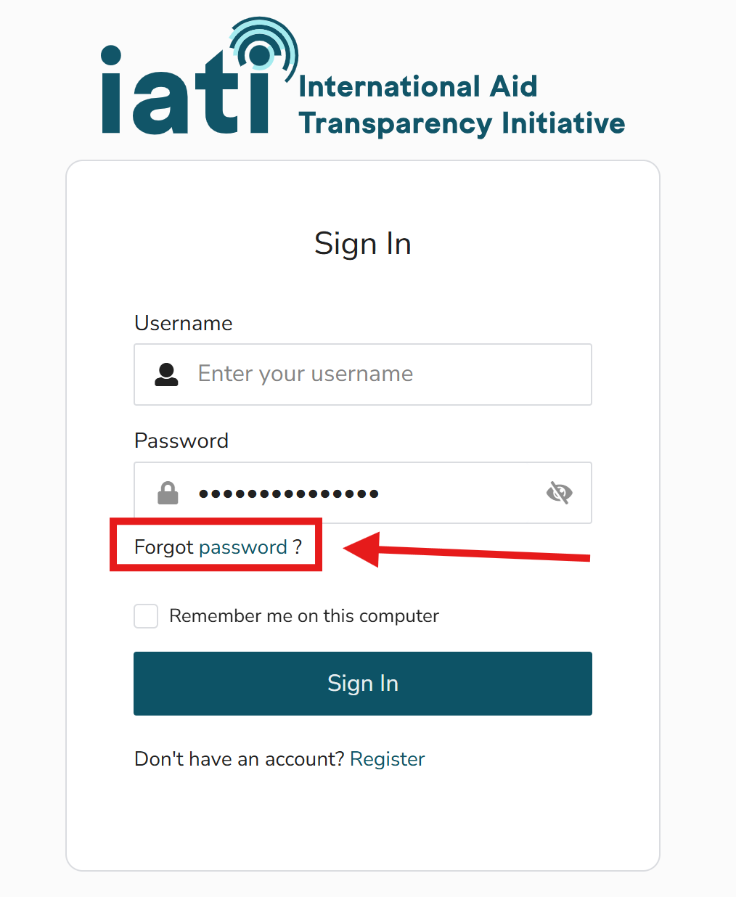

Changing your password
=======================

If you have forgotten your password:

1) Go to the `IATI Account homepage <https://account.iatistandard.org/>`_
2) Click "Sign in with IATI"
3) Click "Forgot password" under the sign in fields

  
4) Enter your email address
5) Use the link in the email you receive to reset your password

Password reset emails for IATI Account are sent from *asgardeo-eu-noreply@wso2.com*. To ensure you receive them, add this address to your safe senders list and check your junk or spam folder. 

Note that password reset links expire after 5 minutes.
                              
.. note::

   It is not yet possible to change your password from within IATI Account. Instead, please follow the steps above to reset your password from the sign-in page.

