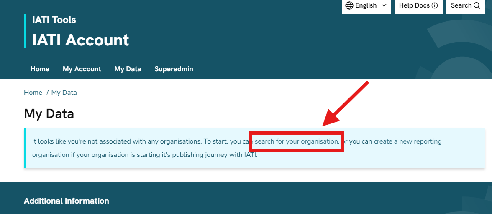
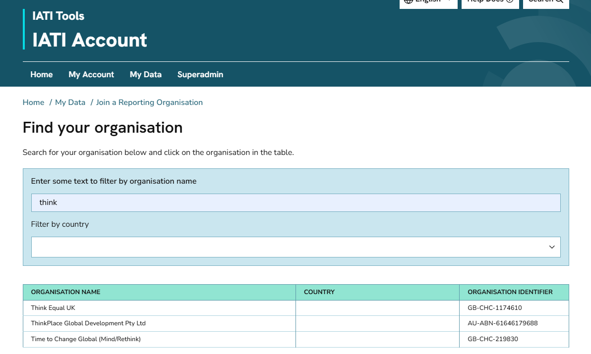
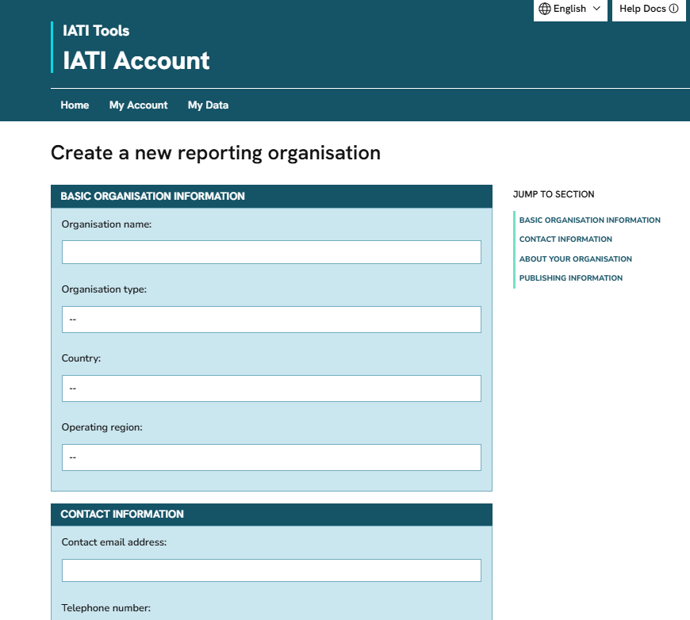

.. _`create_organisation`:
================================
Add yourself to an organisation
================================

If you plan to publish IATI data, you will be prompted to select or add your organisation in IATI Account after completing the user onboarding survey.

Search for an existing organisation
------------------------------------
To check if your organisation is already registered with IATI, click 'search for your organisation' on the "My Data" page:

You can search for your organisation by name or country. Organisations that are already registered with IATI will appear in the list. Click on the one you want to request to join:

Create a new organisation
--------------------------
If your organisation is not yet registered with IATI, there is the option to 'create a new reporting organisation' on the "My Data" page.

You will be prompted to enter information about your organisation:

.. note::

   You can link your IATI Account to more than one organisation. However, some IATI tools — such as IATI Publisher — only allow each user to work with a single organisation.

Organisation approval
-----------------------
New organisations require approval from IATI Support. We will check your unique IATI organisation identifier and ensure that your organisation is not already registered.

`Contact us <https://iatistandard.org/en/guidance/get-support/>`_ if you have not received an email within two working days about your organisation's registration.
