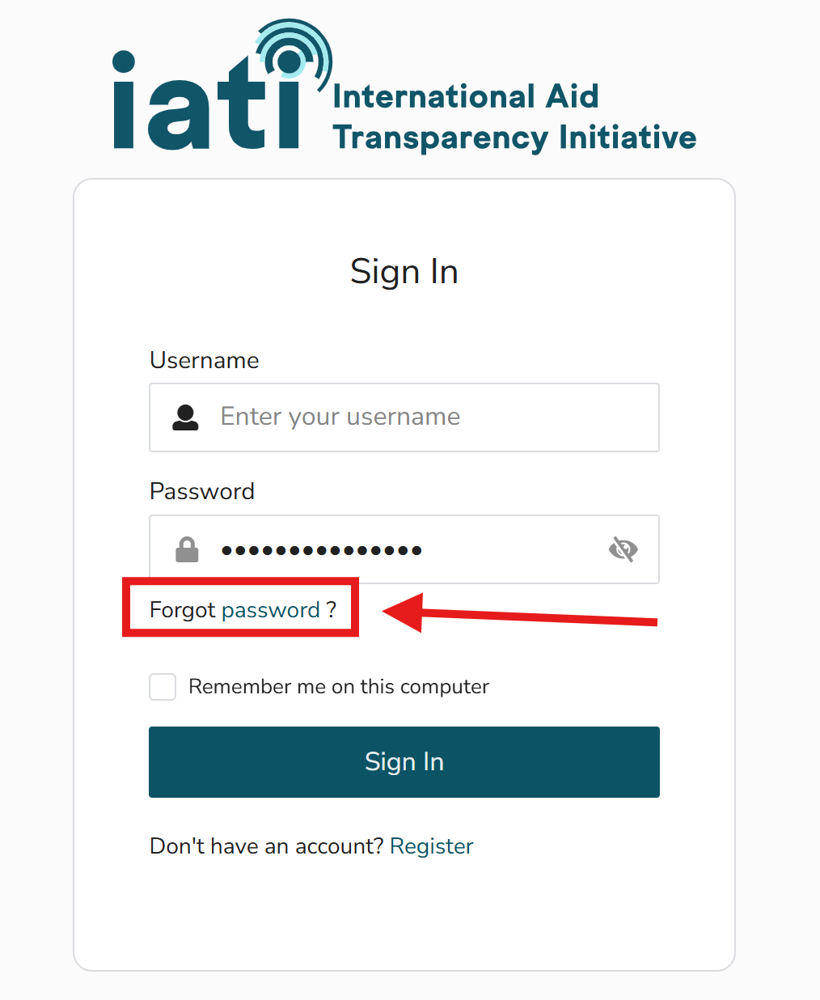

Edit your user profile
=======================

.. caution::

   Some user profile functionality is yet to be launched. This page will be updated as and when new features become available.

Changing your password
-----------------------
It is not yet possible to change your password from within IATI Account.

Instead, you can reset it by clicking "Forgot password" on the sign in screen:

Deleting your user account
---------------------------
Contact `IATI Support <https://iatistandard.org/en/guidance/get-support/>`_ if you need to delete your account.
