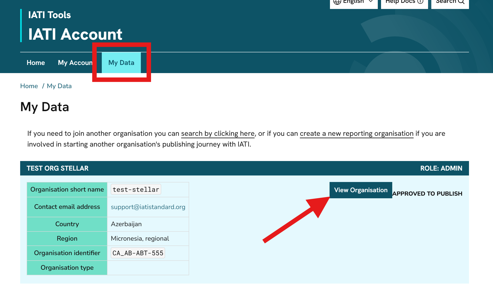
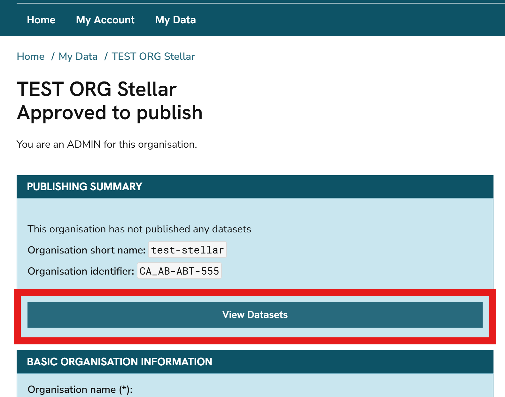
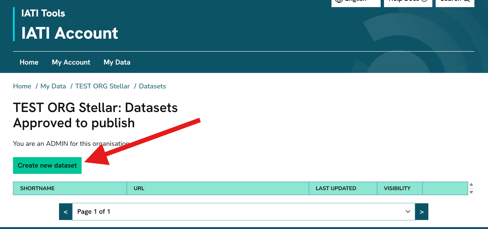
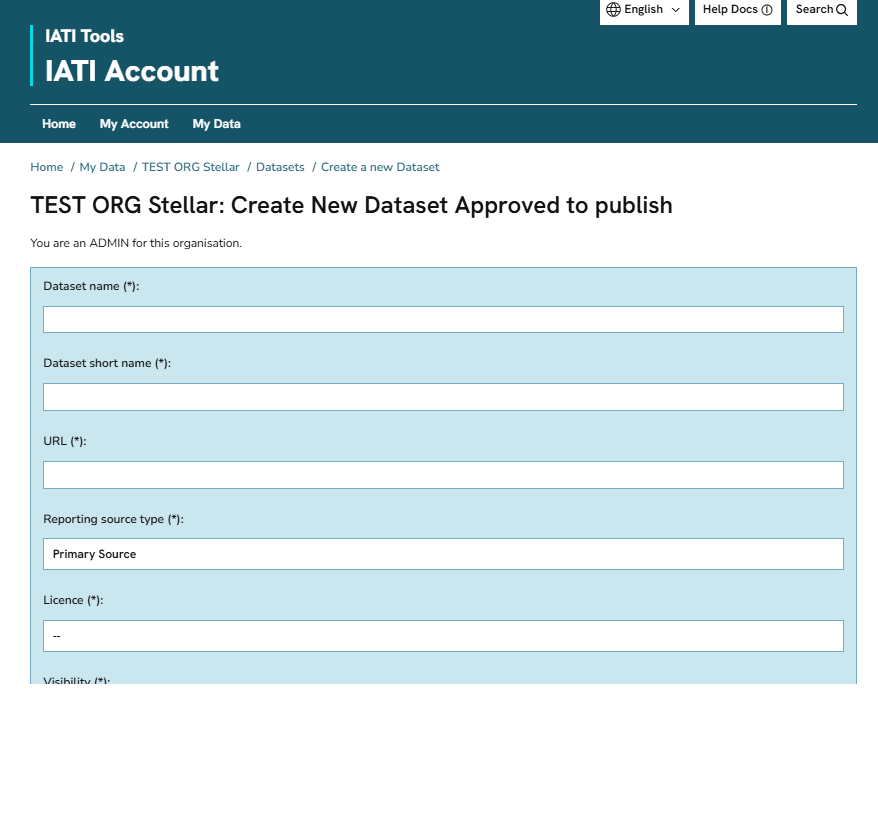

Managing your organisation's IATI data files
=============================================

`IATI Account <https://account.iatistandard.org/en/>`_ is where you manage information about your published IATI data files.

.. attention::

   If you use IATI Publisher, it automatically manages your data file information in IATI Account. You should not edit any file metadata yourself in IATI Account.

Viewing your data files
-------------------------
To view a list of your IATI data files in IATI Account:

1) Go to the 'My Data' page, and click "View Organisation" :  

2)  Click "View Datasets" :

Adding a new data file
-------------------------
To add information about a new IATI data file for your organisation:

1) Click "Create new dataset" on the 'Datasets' page:

2) Complete the form with information about your new IATI file. This includes its publicly accessible URL:

For more information about IATI XML files, see `Creating your own data files <https://iatistandard.org/en/guidance/publishing-data/how-to-publish-data/creating-files/>`_.

Editing a data file
---------------------
To edit the metadata for one of your files, click "View/Edit" next to the relevant file on your organisation's 'Datasets' page:

.. figure:: images/edit_dataset.png
    :width: 70 %
    :align: center
    :alt: A screenshot of how to edit a data file in IATI Account.

.. attention::

   IATI Account does not offer a CSV import option for uploading information on multiple data files at once, unlike the IATI Registry. If you need to add or edit a large number of files, please `contact us for advice <https://iatistandard.org/en/guidance/get-support/>`_.
