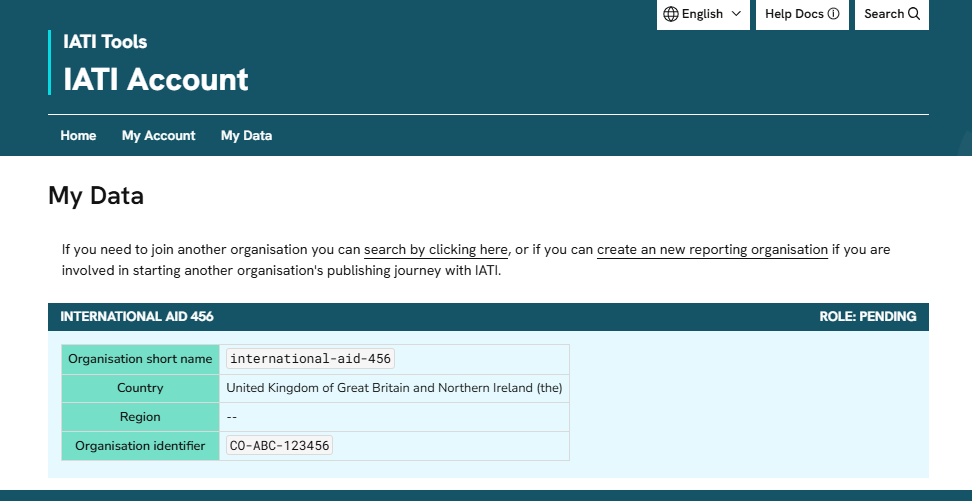

Managing your organisation's account
=====================================
.. caution::

   IATI Account is not yet available. It is due to be released during the second week of December 2025. This warning will be removed when the service is live. 

You can view your organisation information on the `"My Data" page` <https://account.iatistandard.org/en/data/>_:

Any organisations that you are associated with will be listed here.

Editing your organisation information
--------------------------------------

Any admin user from your organisation can edit the following:

- Organisation name
- Country of headquarters
- Organisation type

To edit your organisation's IATI organisation identifier, please contact the `IATI team <https://iatistandard.org/en/guidance/get-support/>`_.

To edit the users associated with your organisation, see :ref:`Managing your organisation's users <manage_org_users>`.
