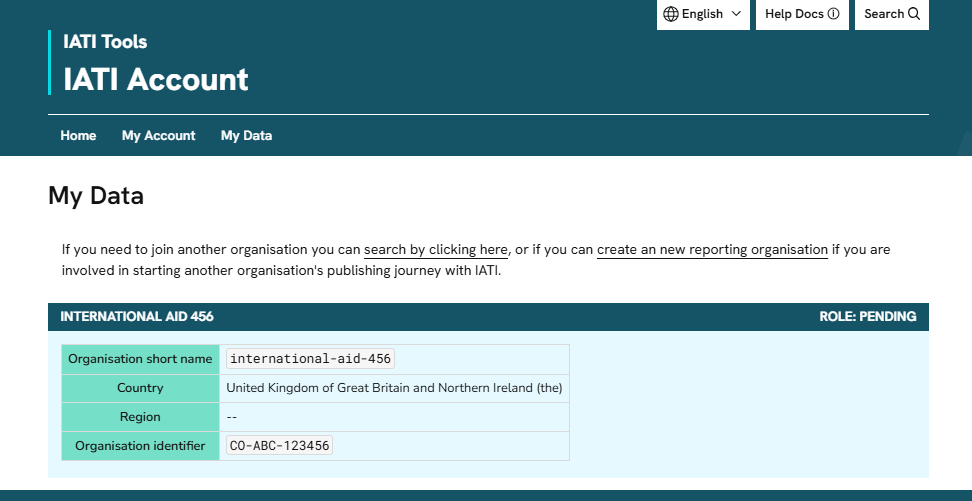

Manage your organisation information
=======================================
You can view your organisation information on the `"My Data" page <https://account.iatistandard.org/en/data/>`_. Any organisations that you are associated with will be listed here:

Edit your organisation information
-----------------------------------

Any admin user from your organisation can edit the following:

- Organisation name
- Country of headquarters
- Organisation type

To edit your organisation's IATI organisation identifier, please `contact us <https://iatistandard.org/en/guidance/get-support/>`_.

To edit the users associated with your organisation, see :ref:`Manage your organisation's users <manage_org_users>`.
