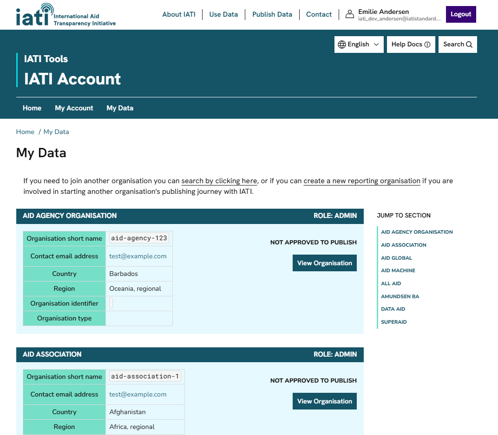
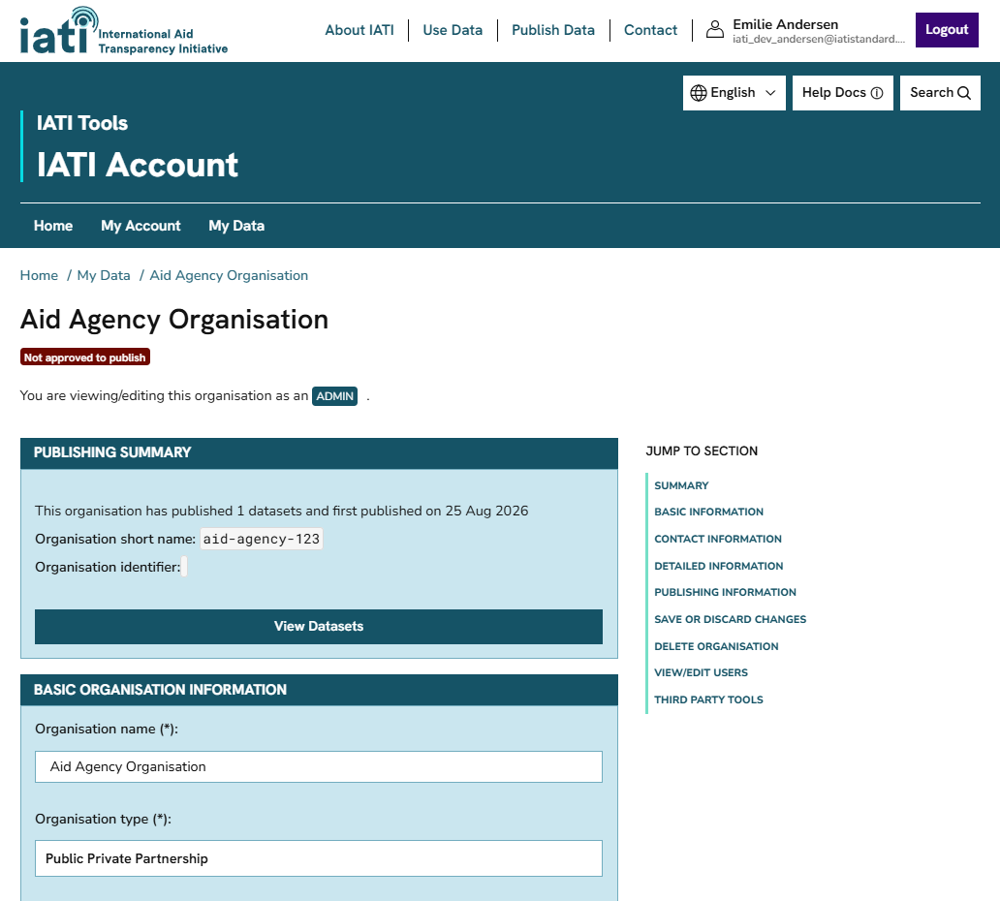

Manage your organisation information
=======================================
You can view all IATI reporting organisations that you are associated with on the `"My Data" page <https://account.iatistandard.org/en/data/>`_:

This will include organisations that you are already a member of and any that you have requested to join (pending approval).

Click "View Organisation" to see the reporting organisation's full details:

Edit your organisation information
-----------------------------------

Any admin user from your organisation can edit the following on your organisation's page:

- Organisation name
- Country of headquarters
- Organisation type

To edit your organisation's IATI organisation identifier, please `contact us <https://iatistandard.org/en/guidance/get-support/>`_.

To edit the users associated with your organisation, see :ref:`Manage your organisation's users <manage_org_users>`.
