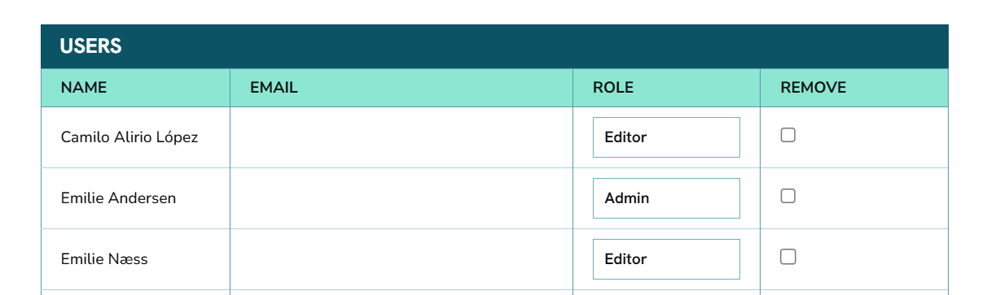

.. _`manage_org_users`:
===================================
Managing your organisation's users
===================================

Only admin users from your organisation will be able to make changes to your organisation's user list in IATI Account.

When signed in to IATI Account, you can view your organisation's users at the bottom of its overview page:

User permissions
-----------------
There are three different permission levels that a user can have within an organisation:

* **Contributor** - this is the lowest permission level. Contributors can add data files or update file metadata.

* **Editor** - In addition to contributor permissions, editors can delete data files and update their organisation's information.

* **Admin** - this is the highest permission level. In addition to editor permissions, admins can approve new users to join the organisation and set user permission levels. They can also update the public visibility of their organisation's data files.

Admin users can change other users' permission levels at any time via their organisation's page.

We encourage admins to regularly check the list of users associated with their organisation to ensure that it is up to date.

Approving a new user
----------------------
All new users should follow the :ref:`instructions on how to register with IATI <user_new_registration>`.

When a user has registered with IATI and requested to join an existing organisation, all admin users of that organisation will receive an email notification. 

One of the admin users will need to approve the new user's request, which will grant them access to the organisation's information and data files.
