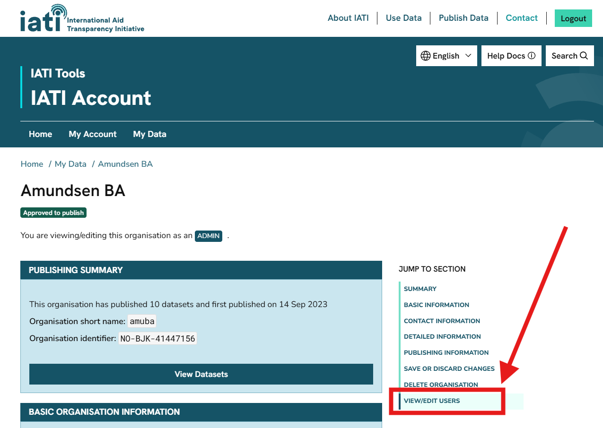
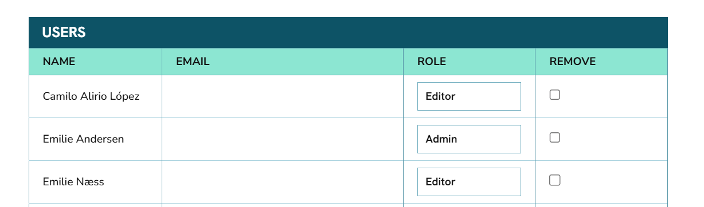
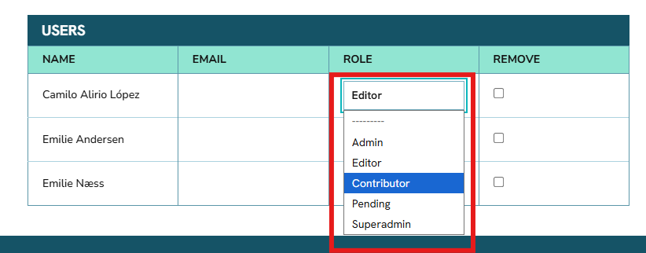
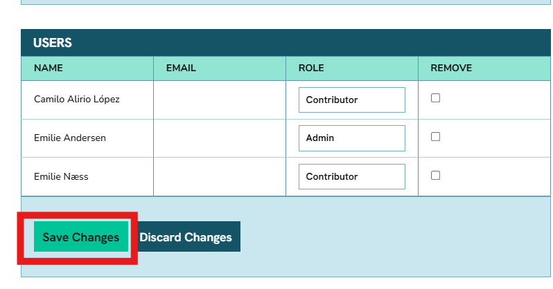
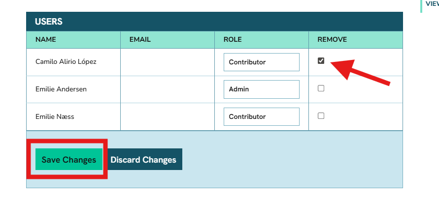

.. _`manage_org_users`:
==================================
Manage your organisation's users
==================================

To view the users associated with your organisation, go to your organisation's page and select "View/Edit Users" from the right-hand menu:

A list of users will be displayed in a table at the bottom of your organisation's page in IATI Account:

Only admin users can make changes to your organisation's user list. We encourage admins to regularly check this list to ensure that it is up to date.

User permissions
-----------------
There are three different roles, with associated permissions, that a user can have within your organisation:

* **Contributor** - this is the lowest permission level. Contributors can add data files or update file metadata.

* **Editor** - In addition to contributor permissions, editors can delete data files and update their organisation's information.

* **Admin** - this is the highest permission level. In addition to editor permissions, admins can approve new users to join the organisation and set user permission levels. They can also update the public visibility of their organisation's data files.

Admins can change another user's role at any time via their organisation's page.

To do this, select a new option from the 'role' column dropdown menu for the intended user:

Remember to save to ensure the change takes effect:

Add a new user
---------------
All new users should follow the :ref:`instructions on how to register with IATI <user_new_registration>`.

When a user has registered with IATI and requested to join an existing organisation, all admin users of that organisation will receive an email notification. 

One of the admins will need to approve the new user's request, which will grant them access to the organisation's information and data files.

Remove a user
--------------
You should remove a user from your organisation if they are no longer involved in your IATI publishing.

Tick the checkbox in the "Remove" column next to the intended user and click "Save Changes":

Removing a user will remove them from your organisation, but not delete their IATI account. For information on account deletion, see `how to manage your profile <edit_user_profile>`.

