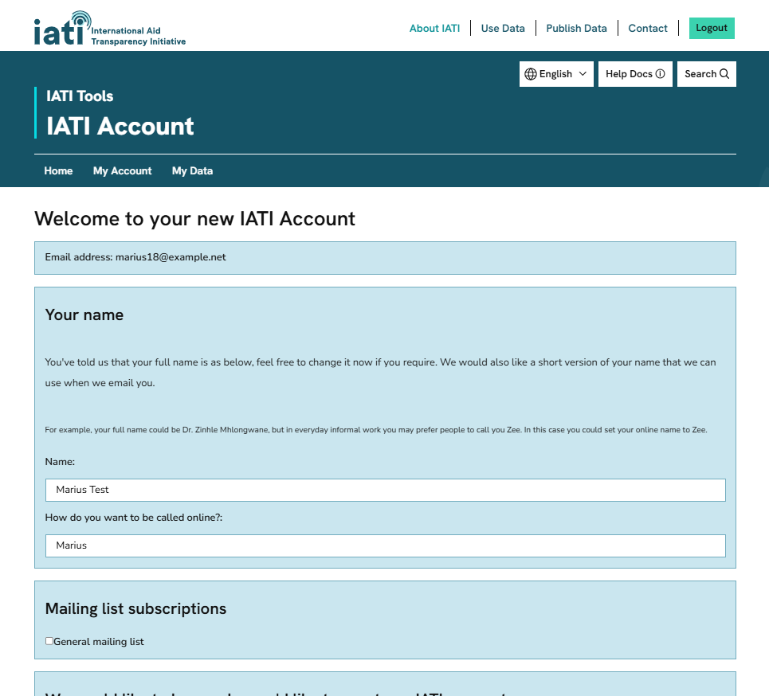

.. _`user_new_registration`:
=======================
Registering with IATI
=======================

To register with IATI, click "Create account" on the `IATI Account homepage <https://dev.account.iatistandard.org/en/>`_.

After signing in to IATI Account for the first time, you will be prompted to complete an onboarding survey. Information collected here will help us signpost you to the most relevant tools and services.

See guidance on :ref:`how to add yourself to an organisation <create_organisation>` if you want to publish IATI data.
