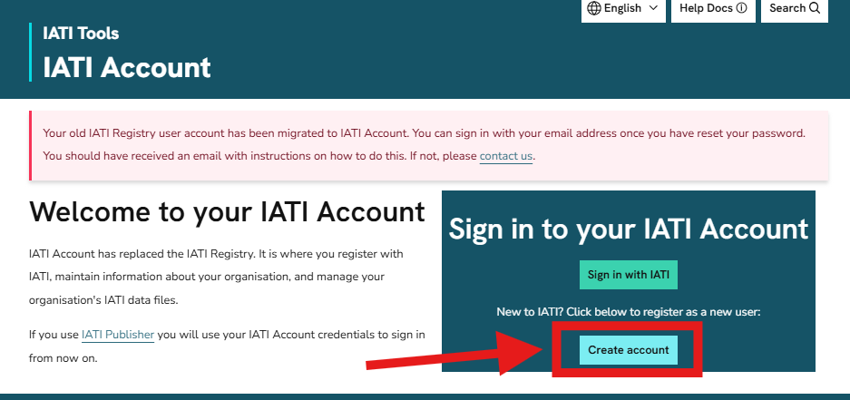

.. _`user_new_registration`:
=======================
Registering with IATI
=======================

.. caution::

   IATI Account is not yet available. It is due to be released during the second week of December 2025. This warning will be removed when the service is live. 

To register with IATI, click "Create account" on the `IATI Account homepage <https://account.iatistandard.org/>`_.

You will be asked to verify your account by entering a 6 digit authentication code sent to your email address.

After signing in to IATI Account for the first time, you will be prompted to complete an onboarding survey. Information collected here will help us signpost you to the most relevant tools and services.

.. figure:: images/onboarding_survey.png
    :width: 100 %
    :align: center
    :alt: Screenshot of the onboarding survey that a new user sees when they sign in to IATI Account

See guidance on :ref:`how to add yourself to an organisation <create_organisation>` if you want to publish IATI data.
