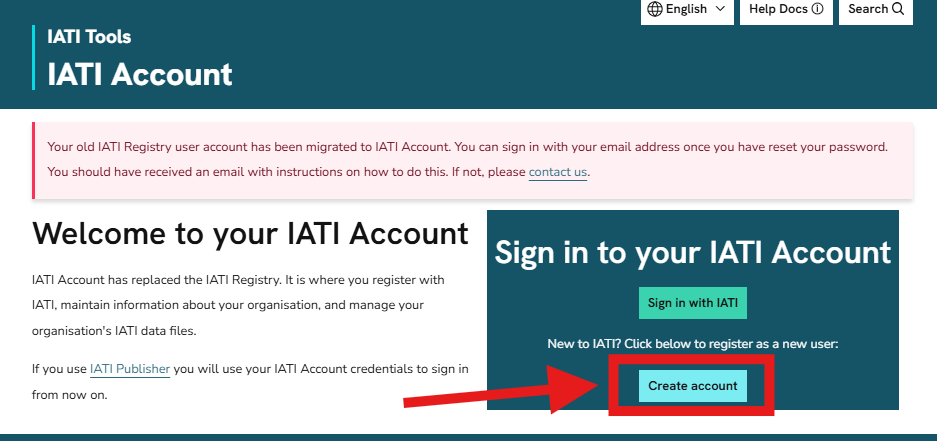
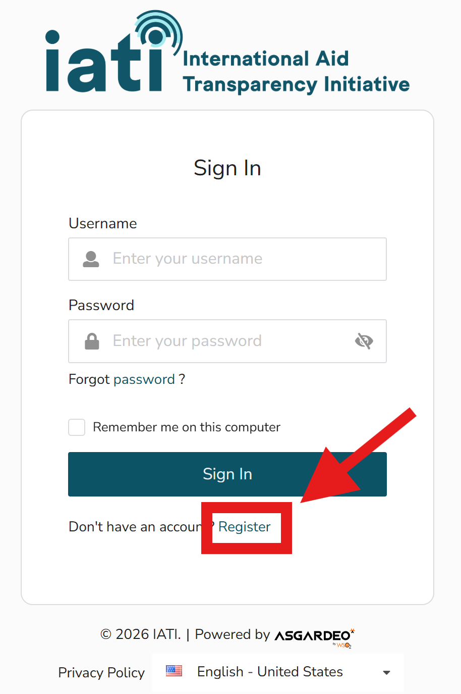
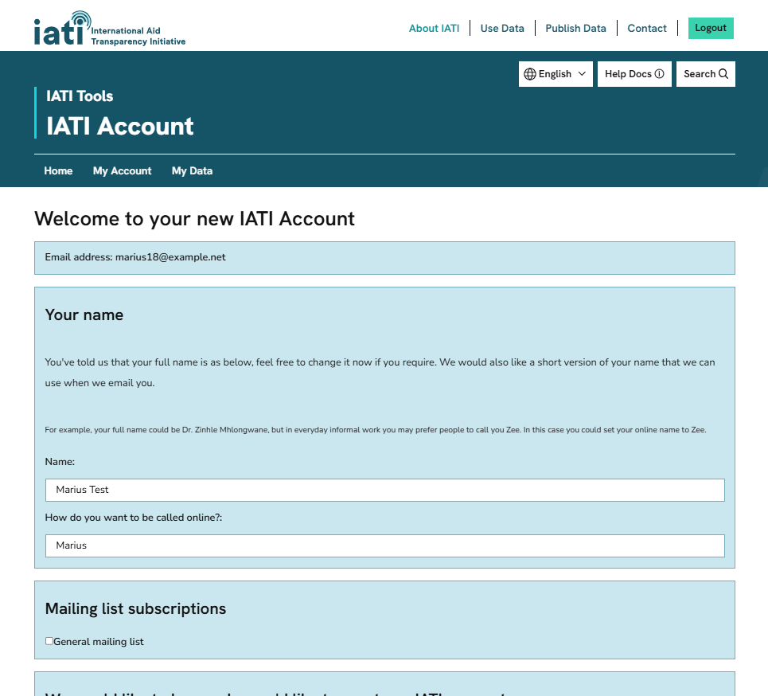

.. _`user_new_registration`:
=======================
Register with IATI
=======================

To register with IATI, go to the `IATI Account homepage <https://account.iatistandard.org/>`_ and click "Create account":

Click "Register" underneath the button to Sign In:

You will be asked to verify your account by entering a 6 digit authentication code sent to your email address.

After signing in to IATI Account for the first time, you will be prompted to complete an onboarding survey. Information collected here will help us signpost you to the most relevant tools and services.

.. tip::
    If you want to publish IATI data, follow the guidance on :ref:`how to join an organisation <join_organisation>` next.
