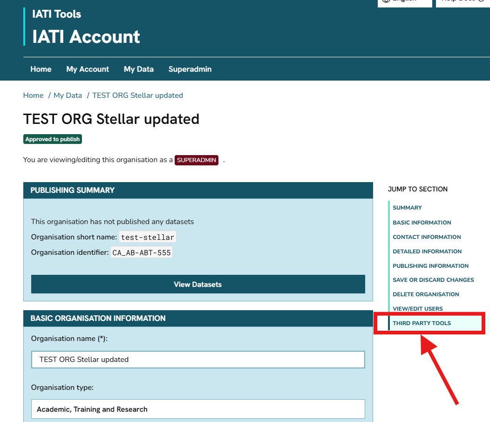
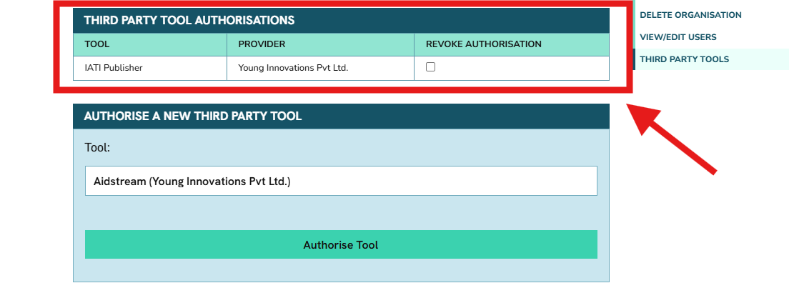
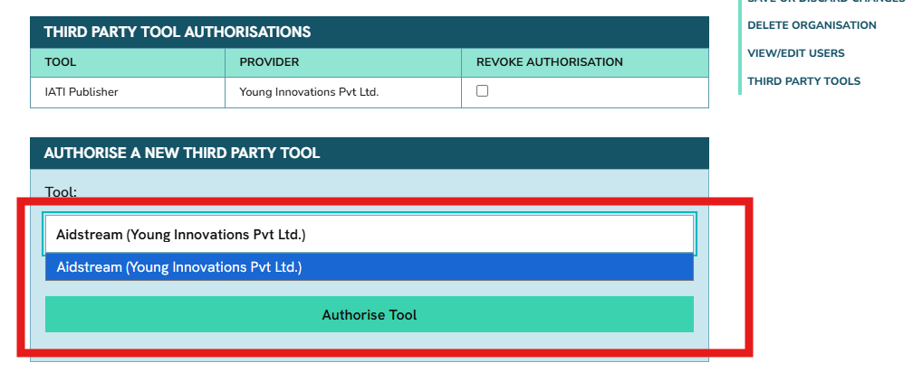
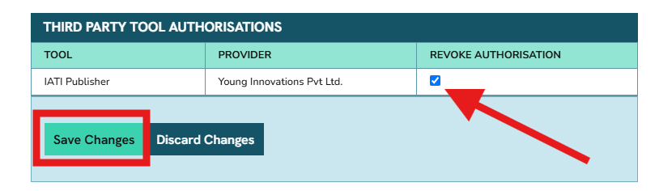

.. _`tool_permissions`:
========================
Manage tool permissions
======================== 

A `variety of tools are available <https://iatistandard.org/en/guidance/publishing-data/how-to-publish-data/publishing-tools-and-services-to-create-your-iati-data-files/>`_ to help organisations publish IATI data. The two most commonly used are:

* `IATI Publisher <https://publisher.iatistandard.org/>`_ (maintained by the IATI Secretariat)
* `AidStream <https://aidstream.org/>`_ (a third-party tool)

|

Both tools connect to IATI's Register Your Data service, which automatically registers your datasets with IATI. This means you won't need to interact directly with IATI Account, except for your organisation's initial registration.

When you sign in to IATI Publisher or AidStream, the tool automatically detects which IATI reporting organisation(s) you're associated with, along with your permission level for each (admin, editor, or contributor). Organisation admins can `manage these user permissions in IATI Account <https://docs.account.iatistandard.org/en/latest/manage_organisation_users/#user-permissions>`_.

In some cases, third-party publishing tools may need permission to change your organisation's published IATI data — for example, to help troubleshoot an issue you're experiencing. To allow this, we've introduced third-party permissions, which organisation admins can manage for individual publishing tools from their organisation's page in IATI Account.

|

Why do tool providers need this permission?
-------------------------------------------
Third-party tool providers should only make changes to your organisation's IATI datasets in the following cases:

* **To troubleshoot an issue** — for example, if your organisation is unable to publish data.
* **To fulfil a direct request from your organisation** — for example, to unpublish data.
* **To manage your IATI data on your organisation's behalf** — as part of a commercial agreement.

Your organisation can still use IATI Publisher and AidStream to publish IATI data without granting these permissions. However, we recommend authorising access for the reasons outlined above.

|

How do I manage tool permissions?
----------------------------------
While signed in to IATI Account, you can view the reporting organisations you're associated with on the `'My Data' <https://account.iatistandard.org/en/data/>`_ page. Clicking 'View Organisation' will show the full details for your organisation in IATI Account.

This includes a 'Third Party Tools' section:

|

In this section, you will see a list of tools that currently have permission to edit your IATI datasets:

|

If you need to authorise a new tool, you can select it in the dropdown menu under 'Authorise a new third party tool':

|

.. note::

   You should typically only be using one IATI publishing tool, so there's rarely a need to authorise more than one tool to access your account. If you switch tools, you can revoke the old tool's access using the instructions below.

|

How do I revoke a tool's permissions?
-------------------------------------

You can revoke a tool's permission at any time by checking the box in the 'Revoke Authorisation' column, then clicking 'Remove':

|

.. caution::

   Revoking a tool's permission will affect the provider's ability to support you if you need help with your data publishing. We don't recommend doing this if your organisation is still actively using the tool for publishing.

|

Which tools can I authorise?
----------------------------
Currently, only IATI Publisher and AidStream work with IATI's Register Your Data service — these are the only two tools you can authorise via IATI Account, bearing in mind that your organisation should only be actively using one of them at a time.

Other third party tools may choose to use the Register Your Data service in future, in which case this page will be updated.
